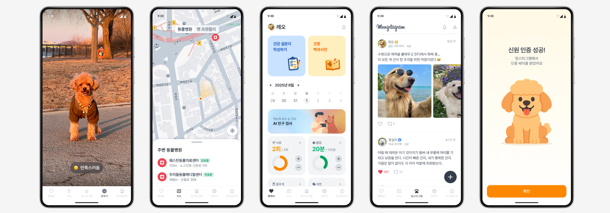
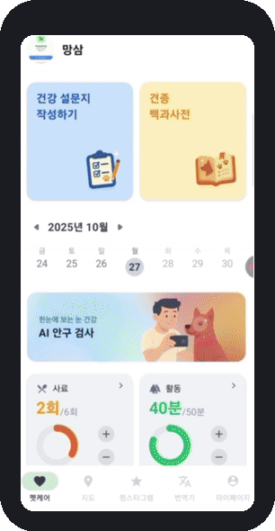
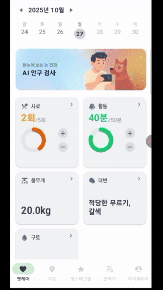
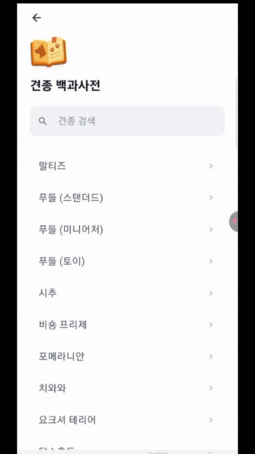
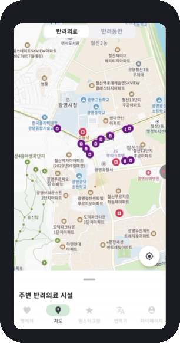

# 행복하개 (Happy-Dog)
## 초보 견주를 위한 올인원 AI 펫케어 애플리케이션

2025 동양미래대학교 컴퓨터공학부 인공지능소프트웨어학과 졸업작품 · 팀 식스센스

---

## 프로젝트 개요

초보 견주는 분산된 정보, 의료비 부담으로 인한 접근 장벽, 반려견 신호 해석의 어려움으로 돌봄에 어려움을 겪습니다.

행복하개는 인공지능 기반 통합 펫케어 애플리케이션으로, 건강 기록과 가이드, 주변 병원·동반 시설 지도, 강아지 전용 커뮤니티, 행동 해석 기능을 한 곳에서 제공합니다. 안구 질환 사전 스크리닝, 비문 기반 신원 인증, 영상 기반 행동·감정 분석을 통해 돌봄 의사결정의 정확성과 커뮤니티 신뢰도를 높이는 것을 목표로 합니다.

안구 질환 스크리닝 기능은 임상 진단을 대체하지 않는 보조 도구로 설계되었습니다.

## 데모 및 주요 기능
 
### 펫케어
 
사료·활동·체중 등 건강 지표 기록·관리, 견종 백과사전·건강 설문지 제공. 눈 사진 기반 AI 안구 검사로 결막염·백내장·궤양성 각막질환·안검내반증 가능성 추정
 

 
  
  
  

### 지도
 
사용자 위치 기준 주변 동물병원·반려견 동반 가능 시설 정보 제공
 

  

### 멍스타그램
 
강아지 전용 SNS. 비문 등록 기반 견주 인증으로 신뢰도 있는 커뮤니티 형성
 

  

### 강아지 번역기
 
반려견 행동 영상을 AI가 분석해 감정 및 상태를 자연어로 표시
 

  

## 핵심 기술

### 1. 질환 분석 모델 (AI 안구 검사)
안구 이미지를 전처리·정규화 후 분류기에 투입합니다. ResNet50, EfficientNet-B0, ViT(Vision Transformer)를 비교 실험하여 예측 정확도가 가장 높은 EfficientNet-B0을 최종 채택했습니다. 소프트맥스로 질환별 확률을 산출하며, 모든 질환의 예측 확률이 40% 이하일 경우 정상으로 판정합니다.

### 2. 비문 인식 모델 (멍스타그램 신원 인증)
SE-ResNeXt-50 계열 백본에 스타일 변동·채널 중요도를 다루는 모듈을 결합한 커스텀 아키텍처를 사용합니다. 동일 개체의 비문 임베딩은 가깝게, 다른 개체는 멀어지도록 임베딩 공간을 학습시키고, 업로드 이미지에서 비문 영역을 자동 검출·크롭한 뒤 코사인 유사도 비교로 동일 개체 여부를 인증합니다.

### 3. 행동 분석 모델 (강아지 번역기)
영상에서 2D 키포인트(코·이마·입꼬리·목·다리·꼬리 등 주요 관절군)를 추출해 시계열 입력을 구성하고, 바운딩 박스 기준 정규화로 스케일 불변성을 확보합니다. LSTM 기반 분류기로 공격성·공포/불안·편안/안정·화남/불쾌·슬픔 등 감정·상태를 출력합니다.

## 개발 환경

Figma, Python, Kotlin, Android Studio, Flask, GitHub, Postman, Firebase Firestore, Firebase Storage, PyTorch, TensorFlow

## 팀 소개 — 식스센스

| 이름 | 역할 |
|---|---|
| 김유진 | AI, 프론트엔드 |
| 심수현 | 프론트엔드 |
| 김보성 | AI, 프론트엔드 |
| 박정호 | AI, 백엔드 |
| 김민결 | UI/UX, 프론트엔드 |
| 김동연 | 프론트엔드 |

지도교수: 조진형

## 자료

- 2025 동양미래대학교 컴퓨터공학부 졸업작품집 수록 프로젝트

---

"현재는 별도로 배포되어 있지 않으며, 위 스크린샷은 개발 당시 실행 화면입니다."
